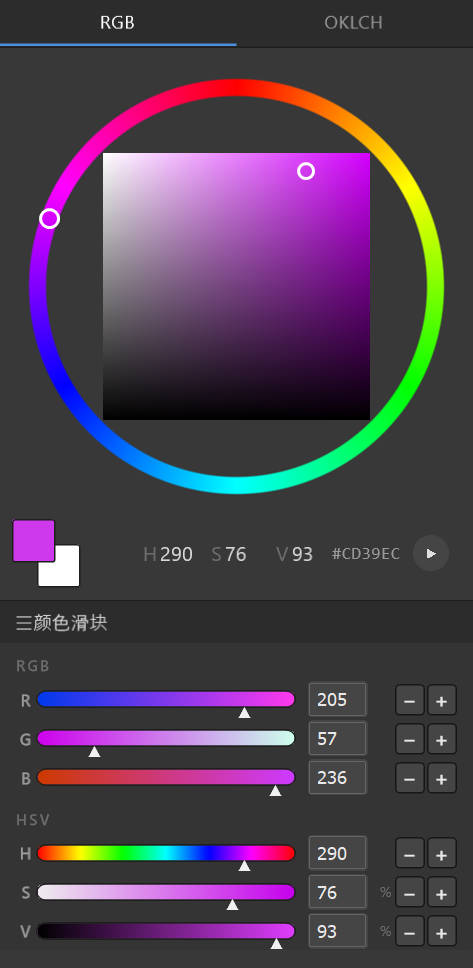
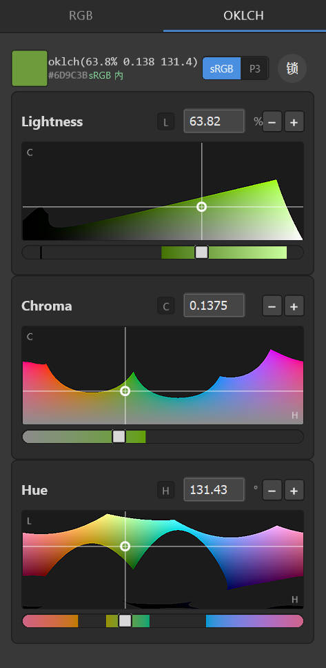

# 调色盘 Color Palette — Photoshop 取色插件

仿 PS / Krita 风格的取色面板：**RGB 色环** 与 **OKLCH 感知色彩** 双视图，支持**画布实时吸色**与**色域锁**。另配一套绘画键位脚本（AutoHotkey）。

技术方案：**UXP Hybrid**（UXP 前端 + 进程内 C++ `.uxpaddon` 原生取色模块）。要求 **Photoshop 24.2+**，**仅 Windows x64**。

  
  &nbsp;&nbsp;
  

左：RGB（色环 + 方形 SV + RGB/HSV 滑块）　·　右：OKLCH（L/C/H 三卡 2D 色域切片 + 色域锁）

---

## ✨ 功能

### 🎡 RGB 取色（色环视图）
色环 + 方形 SV 取色区 + RGB/HSV 滑块，所见即所得。色环用 **JS 逐像素 + UXP Imaging API 程序化生成**（无 PNG 资源、与游标精确对齐、抗锯齿）。

### 🎨 OKLCH 取色（感知均匀）
- **Lightness / Chroma / Hue** 三张卡片，各含 **2D 色域切片图** + 渐变滑块。OKLCH 改 L/C/H 时色相、明度更稳定，配色更直觉。
- **色域锁（默认开启，右上角「锁」）**：拖动时取色点贴着 **sRGB/P3 色域边界曲线滑动、选不出界**；可切 sRGB / P3，也可解锁自由选超域色。
- 逐像素渲染走 Imaging API；十字/圆点/游标用 `transform`（GPU 独立合成层），拖动顺滑无抖动。

### 🎯 画布实时吸色（核心功能）
**三击 Alt（快速连点三下）→ 第三下按住 → 在画布上划过** = 连续实时显示光标处颜色（合并色）；松开 Alt 写入前景色。单/双击 Alt 只读取 PS 前景色，三击才激活（防误触）。进程内 C++ `.uxpaddon` 后台线程采样，低延迟不卡。

### ⌨️ 绘画键位脚本（AutoHotkey，可选）
[`ahk/ps-paint-keys.ahk`](ahk/ps-paint-keys.ahk) 把 PS 改成绘画友好的左手键位，**仅 Photoshop 前台时生效**：

| 键 | 功能 | 键 | 功能 |
|---|---|---|---|
| `Q` `E` `R` | 画笔 / 橡皮 / 套索 | `A` `V` `Z` | 旋转视图 / 魔棒 / 形状 |
| `C` | 涂抹（模糊笔刷） | `W` `S` `T` | 放大 / 缩小 / 水平翻转 |
| `Ctrl+F` | 前景色填充 | `Ctrl+Alt+拖` | 改笔刷大小 |
| `Ctrl+左键拖` | 已禁用（防误触移动内容） | `F1` | 暂停 / 恢复脚本 |

> 首次用需装 [AutoHotkey v2](https://www.autohotkey.com/) 并在 PS 配 2 个快捷键，详见 **[ahk/README.md](ahk/README.md)**。

---

## 📦 安装

### 插件
1. 到 **[Releases](../../releases)** 下载 `.ccx`，双击 → Creative Cloud 自动安装（或在 PS「增效工具」里启用）。
2. Photoshop 菜单 **增效工具 → 调色盘** 打开面板。
3. ⚠️ 仅 **Windows x64**（含原生取色模块），需 **Photoshop 24.2+**。

> 两个并存版本：正式版 **调色盘 Hybrid**（色环）/ 原型 **调色盘 OKLCH 原型**（含 OKLCH 标签页 + 色域锁，独立 id，可与正式版同时安装、对比）。

### 键位脚本（可选）
装 [AutoHotkey v2](https://www.autohotkey.com/) → 双击 [`ahk/ps-paint-keys.ahk`](ahk/ps-paint-keys.ahk)（Release 里也附了一份）。首配步骤见 [ahk/README.md](ahk/README.md)。

---

## 📂 仓库结构

| 路径 | 说明 |
|---|---|
| **[`uxp-hybrid/`](uxp-hybrid/)** | 插件本体 + 原生模块源码 + 打包脚本 |
| [`uxp-hybrid/README.md`](uxp-hybrid/README.md) | 📖 开发/使用说明：UXP 踩坑、性能要点、构建打包 |
| [`uxp-hybrid/dist/`](uxp-hybrid/dist/) | 📦 打包好的 `.ccx` |
| [`ahk/`](ahk/) | ⌨️ 绘画键位脚本 + 说明 |
| `img/` | 截图 |

开发踩坑（UXP 渲染限制、拖动抖动/卡顿根治、Imaging API、性能优化、色域数学）全部记录在 **[uxp-hybrid/README.md](uxp-hybrid/README.md)**。
